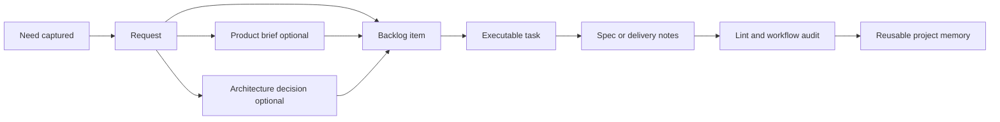

# cdx-logics-kit

<p align="center">
  <a href="https://github.com/AlexAgo83/cdx-logics-kit"></a>
  <a href="./LICENSE"></a>
  
  
  
  
</p>

A reusable Logics kit to import into your projects under `logics/skills/`.

The kit standardizes a lightweight Markdown workflow with optional companion decision docs:

`logics/request` -> `logics/backlog` -> `logics/tasks` -> `logics/specs`

Companion framing docs can be added when needed:

- `logics/product` for product briefs and product decision framing
- `logics/architecture` for architecture decisions and structural technical choices

It also ships scripts and skills to create, promote, lint, audit, review, and enrich those docs so project context stays durable, inspectable, and reusable across AI sessions.



## VS Code extension

Related project (VS Code extension for Logics): `https://github.com/AlexAgo83/cdx-logics-vscode`.

## Prerequisites

- `python3` (scripts are stdlib-based except explicit optional tools such as mockup generation)
- `git`

## Install (recommended: submodule)

In a new project repo:

```bash
mkdir -p logics
git submodule add -b main git@github.com:AlexAgo83/cdx-logics-kit.git logics/skills
git submodule update --init --recursive
```

HTTPS variant:

```bash
git submodule add -b main https://github.com/AlexAgo83/cdx-logics-kit.git logics/skills
git submodule update --init --recursive
```

Then bootstrap the Logics tree (creates missing folders + `.gitkeep`, and a default `logics/instructions.md` if missing):

```bash
python3 logics/skills/logics-bootstrapper/scripts/logics_bootstrap.py
```

## Usage (inside the project repo)

### Create workflow docs

Create a request, backlog item, or task with auto-incremented IDs:

```bash
python3 logics/skills/logics-flow-manager/scripts/logics_flow.py new request --title "My first need"
python3 logics/skills/logics-flow-manager/scripts/logics_flow.py new backlog --title "My first need"
python3 logics/skills/logics-flow-manager/scripts/logics_flow.py new task --title "Implement my first need"
```

For backlog/task docs, `logics_flow.py` now evaluates product and architecture signals and writes a `# Decision framing` section. The detection is advisory by default and can auto-create companion docs when the signal is strong:

```bash
python3 logics/skills/logics-flow-manager/scripts/logics_flow.py new backlog \
  --title "Checkout auth migration" \
  --auto-create-product-brief \
  --auto-create-adr
```

Create a product brief in `logics/product` when the subject needs a non-technical framing artifact:

```bash
python3 logics/skills/logics-product-brief-writer/scripts/new_product_brief.py --title "Guest checkout framing"
```

Create an architecture decision in `logics/architecture` when the subject needs a structural technical decision:

```bash
python3 logics/skills/logics-architecture-decision-writer/scripts/new_adr.py --title "Choose cache strategy"
```

Create a functional spec in `logics/specs`:

```bash
python3 logics/skills/logics-spec-writer/scripts/logics_spec.py new --title "My first spec" --from-version 1.0.0
```

Status model used by generated docs:

- `Draft`
- `Ready`
- `In progress`
- `Blocked`
- `Done`
- `Archived`

Metadata contract for normalized workflow docs:

- `Status` is the canonical workflow indicator for requests, backlog items, and tasks.
- `Progress` may still exist on backlog items and tasks, but it is supplemental rather than canonical.
- Transitional legacy rule:
- older docs may still carry `Progress: 100%`
- normalized docs should also carry `Status: Done`
- New docs and touched docs should not rely on missing `Status`.

### Promote between stages

```bash
python3 logics/skills/logics-flow-manager/scripts/logics_flow.py promote request-to-backlog logics/request/req_001_my_first_need.md
python3 logics/skills/logics-flow-manager/scripts/logics_flow.py promote backlog-to-task logics/backlog/item_002_my_first_need.md
```

### Finish and close docs

When a task is actually completed, use the guarded finish flow:

```bash
python3 logics/skills/logics-flow-manager/scripts/logics_flow.py finish task logics/tasks/task_003_implement_my_first_need.md
```

`finish task` is the recommended path because it closes the task, propagates closure to linked backlog/request docs when eligible, and verifies the linked chain.

Lower-level close commands are still available when you explicitly want the primitive transition commands:

```bash
python3 logics/skills/logics-flow-manager/scripts/logics_flow.py close task logics/tasks/task_003_implement_my_first_need.md
python3 logics/skills/logics-flow-manager/scripts/logics_flow.py close backlog logics/backlog/item_002_my_first_need.md
python3 logics/skills/logics-flow-manager/scripts/logics_flow.py close request logics/request/req_001_my_first_need.md
```

### Sync workflow state

```bash
python3 logics/skills/logics-flow-manager/scripts/logics_flow.py sync close-eligible-requests
```

### Audit workflow coherence

Audit closure consistency, orphan items, stale pending docs, acceptance-criteria traceability, and DoR/DoD gates:

```bash
python3 logics/skills/logics-flow-manager/scripts/workflow_audit.py
python3 logics/skills/logics-flow-manager/scripts/workflow_audit.py --group-by-doc
python3 logics/skills/logics-flow-manager/scripts/workflow_audit.py --format json
python3 logics/skills/logics-flow-manager/scripts/workflow_audit.py --autofix-ac-traceability
```

Note: request → backlog promotion should keep cross‑references in sync (backlog item notes reference the request, and the request lists generated backlog items in a `# Backlog` section).

### Lint Logics docs

Check Logics conventions:

```bash
python3 logics/skills/logics-doc-linter/scripts/logics_lint.py
```

### Run kit tests

Run Python tests for the kit:

```bash
python3 -m unittest discover -s logics/skills/tests -p "test_*.py" -v
```

## Indicators

Requests, backlog items, and tasks include these top-level indicators:

- `From version:`
- `Status:` (`Draft | Ready | In progress | Blocked | Done | Archived`)
- `Understanding:`
- `Confidence:`
- `Progress:` (mainly tasks, optionally backlog)
- `Complexity:` (for example `Low | Medium | High`)
- `Theme:` (for example `Combat | Items | Economy | UI`)

These fields keep the flow scannable and make it easier to group work by theme and delivery state.

Normalization note:

- request docs should always include `Status`
- backlog/task docs should include both `Status` and `Progress`
- when a backlog/task is complete, prefer `Status: Done` with `Progress: 100%`

## Connectors

### Linear connector (issues → Logics backlog)

Prereqs: `LINEAR_API_KEY` (and optionally `LINEAR_API_URL`, `LINEAR_API_TEAM_ID`). For Linear API keys, use `Authorization: $LINEAR_API_KEY` (no `Bearer` prefix).

List issues:

```bash
python3 logics/skills/logics-connector-linear/scripts/linear_list_issues.py --team-id "$LINEAR_API_TEAM_ID"
```

Import an issue as a backlog item:

```bash
python3 logics/skills/logics-connector-linear/scripts/linear_to_backlog.py --issue "CIR-42"
```

### Figma connector (nodes → export / Logics backlog)

Prereqs: `FIGMA_TOKEN_PAT` (header `X-Figma-Token`) and a `FIGMA_FILE_KEY`.

List pages:

```bash
python3 logics/skills/logics-connector-figma/scripts/figma_list_pages.py --file-key "$FIGMA_FILE_KEY"
```

Export a node as PNG:

```bash
python3 logics/skills/logics-connector-figma/scripts/figma_export_node.py \
  --file-key "$FIGMA_FILE_KEY" --node-id "1744:4185" --format png --scale 2 \
  --out "output/figma/weekly.png"
```

Import a node reference as a backlog item:

```bash
python3 logics/skills/logics-connector-figma/scripts/figma_to_backlog.py \
  --file-key "$FIGMA_FILE_KEY" --node-id "1744:4185" --export
```

### Confluence connector (pages → Logics requests)

Prereqs: `CONFLUENCE_DOMAIN` (preferred, `CONFLUENCE_DOMAINE` legacy alias is also supported), `CONFLUENCE_EMAIL`, `CONFLUENCE_API_TOKEN`.

Search pages (CQL):

```bash
python3 logics/skills/logics-connector-confluence/scripts/confluence_search_pages.py \
  --cql "space=dt AND text~\\\"flotauto\\\"" --limit 10
```

Import a page as a request (stores Confluence HTML as context):

```bash
python3 logics/skills/logics-connector-confluence/scripts/confluence_to_request.py --page-id 234913873
```

### Jira connector (issues → Logics backlog)

Prereqs: `JIRA_BASE_URL`, `JIRA_EMAIL`, `JIRA_API_TOKEN`.

Search issues (JQL):

```bash
python3 logics/skills/logics-connector-jira/scripts/jira_search_issues.py \
  --jql "project = CIR ORDER BY created DESC" --limit 20
```

Import an issue as a backlog item:

```bash
python3 logics/skills/logics-connector-jira/scripts/jira_to_backlog.py --issue "CIR-123"
```

### Render connector (services/deploys/plans → Logics backlog)

Prereqs: `RENDER_API_KEY` (Bearer API key). Optional: `RENDER_API_BASE_URL`, `RENDER_OPENAPI_URL`.

List services:

```bash
python3 logics/skills/logics-connector-render/scripts/render_list_services.py --limit 100
```

List deploys for a service:

```bash
python3 logics/skills/logics-connector-render/scripts/render_list_deploys.py --service-id srv-xxxxxxxx --limit 20
```

Manage deployment plans:

```bash
python3 logics/skills/logics-connector-render/scripts/render_manage_deployment_plans.py show-plans
python3 logics/skills/logics-connector-render/scripts/render_manage_deployment_plans.py snapshot \
  --out logics/external/render/render_deployment_plan.snapshot.json
python3 logics/skills/logics-connector-render/scripts/render_manage_deployment_plans.py apply \
  --plan-file logics/external/render/render_deployment_plan.snapshot.json --validate-only
```

Import a Render service context as a backlog item:

```bash
python3 logics/skills/logics-connector-render/scripts/render_to_backlog.py --service-id srv-xxxxxxxx
```

## MCP

### Chrome DevTools MCP (browser control)

Use when you want Codex/agents to open local apps and validate UI directly in Chrome via MCP.

Skill docs:
```
logics/skills/logics-mcp-chrome-devtools/SKILL.md
```

### Terminal MCP (shell control)

Use when you want Codex/agents to run shell commands via MCP.

Skill docs:
```
logics/skills/logics-mcp-terminal/SKILL.md
```

### Figma MCP (Figma connector)

Use when you want Codex/agents to connect to Figma via MCP.

Skill docs:
```
logics/skills/logics-mcp-figma/SKILL.md
```

### Linear MCP (Linear connector)

Use when you want Codex/agents to connect to Linear via MCP.

Skill docs:
```
logics/skills/logics-mcp-linear/SKILL.md
```

### Notion MCP (Notion connector)

Use when you want Codex/agents to connect to Notion via MCP.

Skill docs:
```
logics/skills/logics-mcp-notion/SKILL.md
```

## Update the kit (inside an existing project)

Update the submodule to the latest `main`:

```bash
git submodule update --remote --merge
git add logics/skills
git commit -m "Update Logics kit"
```

## Collaboration

Contribution workflow and repository expectations live in `CONTRIBUTING.md`.

## License

This project is licensed under the MIT License. See `LICENSE`.

Pin to a tag (recommended if you want controlled upgrades):

```bash
cd logics/skills
git fetch --tags
git checkout v0.2.0
cd -
git add logics/skills
git commit -m "Pin Logics kit to v0.2.0"
```

## Notes

- This repo is meant to be executed from the **project repo** (where `logics/skills` points to this kit).
- `req_*`, `item_*`, `task_*`, `spec_*` docs stay in the project repo, so there’s no cross-project “pollution”.

## Mockup generator

Generate quick PNG UI mockups under `logics/external/mockup/`:

```bash
python3 logics/skills/logics-mockup-generator/scripts/mockup.py \
  --out logics/external/mockup/dashboard-mock.png
```

## Confidence booster

Raise Understanding/Confidence by asking clarifying questions and updating indicators:

```bash
python3 logics/skills/logics-confidence-booster/scripts/boost_confidence.py logics/request/req_001_example.md
```

## Doc fixer

Validate + repair structure, indicators, and request/backlog/task/product/architecture references:

```bash
python3 logics/skills/logics-doc-fixer/scripts/fix_logics_docs.py
python3 logics/skills/logics-doc-fixer/scripts/fix_logics_docs.py --write
```
