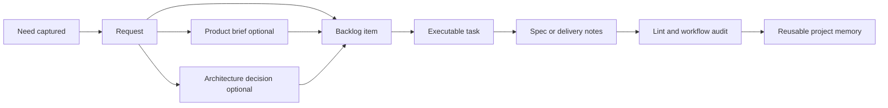

# cdx-logics-kit

<p align="center">
  <a href="https://github.com/AlexAgo83/cdx-logics-kit"></a>
  <a href="./LICENSE"></a>
  
  
  
  
</p>

A reusable Logics kit to import into your projects under `logics/skills/`.

The goal is simple: turn project context into a maintained asset instead of leaving it trapped in issue trackers, AI chats, and tribal memory.

The kit standardizes a lightweight Markdown workflow with optional companion decision docs:

`logics/request` -> `logics/backlog` -> `logics/tasks` -> `logics/specs`

Companion framing docs can be added when needed:

- `logics/product` for product briefs and product decision framing
- `logics/architecture` for architecture decisions and structural technical choices

It also ships scripts and skills to create, promote, lint, audit, review, and enrich those docs so project context stays durable, inspectable, and reusable across AI sessions.

In practice, the kit gives teams a structured delivery memory they can keep in git, automate with scripts, and hand off to assistants without restating the whole project every time.

## Latest Product Features

- Generated Logics index and relationship views make the corpus easier to browse and audit at repository scale.
- Relationship guardrails surface unresolved references and orphan docs earlier, which keeps the corpus healthier as it grows.
- Mermaid generation now stays closer to the workflow docs and produces more contextual diagrams by default.
- Cached context packs and normalized cache keys reduce repeated work in recurring Logics flows.
- Doc-specific reminders are now clearer, so request, backlog, and task edits stay aligned with the kit conventions.

## Why This Matters For AI Projects

- It converts scattered project conversations into a delivery memory that lives with the code.
- Requests, backlog items, tasks, specs, product briefs, architecture decisions, and links become reusable context assets instead of disposable chat fragments.
- Instead of repasting history into every prompt, assistants can rely on the structured `logics/*` corpus as the working memory of the project.
- That usually means lower token usage, more stable agent sessions, and fewer regressions caused by lost context.
- Because the context is stored as Markdown in the repository, it stays reviewable by humans, diffable in git, and portable across tools and teams.



## VS Code extension

Related project (VS Code extension for Logics): `https://github.com/AlexAgo83/cdx-logics-vscode`.

## Prerequisites

- Python 3 available on your `PATH`
- `git`

Canonical examples below use `python ...` as the cross-platform entrypoint.
The preferred stable operator entrypoint is now `python logics/skills/logics.py ...`, which routes to the underlying kit scripts without requiring operators to memorize each script path.
If your shell only exposes `python3` (common on macOS/Linux) or `py -3` (common on Windows), substitute that launcher.

## Install (recommended: submodule)

In a new project repo:

Create a `logics/` folder first if it does not already exist. Use your shell or file explorer; the exact command depends on the shell (`mkdir logics` in PowerShell or `mkdir -p logics` in POSIX shells).

Preferred cross-platform submodule path:

```bash
git submodule add -b main https://github.com/AlexAgo83/cdx-logics-kit.git logics/skills
git submodule update --init --recursive
```

SSH variant (only if your environment is already configured for Git-over-SSH):

```bash
git submodule add -b main git@github.com:AlexAgo83/cdx-logics-kit.git logics/skills
git submodule update --init --recursive
```

Then bootstrap the Logics tree (creates missing folders + `.gitkeep`, and a default `logics/instructions.md` if missing):

```bash
python logics/skills/logics.py bootstrap
```

Bootstrap now also seeds a repo-native `logics.yaml` file with defaults for split policy, bulk-mutation mode, and the incremental runtime index path.
When provider placeholders are missing, bootstrap now scans every root-level `.env*` file, appends the missing keys where needed, and creates `.env.local` only when no env file exists yet.

## Usage (inside the project repo)

The same launcher rule applies throughout:

- preferred documented form: `python ...`
- substitute `python3 ...` if your Unix environment does not expose `python`
- substitute `py -3 ...` on Windows if that is the installed Python launcher

### Create workflow docs

Create a request, backlog item, or task with auto-incremented IDs:

```bash
python logics/skills/logics.py flow new request --title "My first need"
python logics/skills/logics.py flow new request --title "Smoke test" --fixture
python logics/skills/logics.py flow new backlog --title "My first need"
python logics/skills/logics.py flow new task --title "Implement my first need"
```

Use `--fixture` or `--smoke-test` when you want a compact synthetic request that stays opinionated and audit-friendly instead of using the full generic request shape.

For backlog/task docs, `logics_flow.py` now evaluates product and architecture signals and writes a `# Decision framing` section. The detection is advisory by default and can auto-create companion docs when the signal is strong:

```bash
python logics/skills/logics.py flow new backlog --title "Checkout auth migration" --auto-create-product-brief --auto-create-adr
```

Create a product brief in `logics/product` when the subject needs a non-technical framing artifact:

```bash
python logics/skills/logics-product-brief-writer/scripts/new_product_brief.py --title "Guest checkout framing"
```

You can attach the primary linked workflow docs at creation time:

```bash
python logics/skills/logics-product-brief-writer/scripts/new_product_brief.py --title "Guest checkout framing" --request req_001_guest_checkout --backlog item_002_guest_checkout --architecture adr_004_checkout_strategy
```

Create an architecture decision in `logics/architecture` when the subject needs a structural technical decision:

```bash
python logics/skills/logics-architecture-decision-writer/scripts/new_adr.py --title "Choose cache strategy"
```

You can attach the linked primary-flow docs at creation time:

```bash
python logics/skills/logics-architecture-decision-writer/scripts/new_adr.py --title "Choose cache strategy" --request req_001_guest_checkout --backlog item_002_guest_checkout --task task_003_checkout_cache
```

Create a functional spec in `logics/specs`:

```bash
python logics/skills/logics-spec-writer/scripts/logics_spec.py new --title "My first spec" --from-version 1.4.0
```

Status model used by generated docs:

- `Draft`
- `Ready`
- `In progress`
- `Blocked`
- `Done`
- `Archived`

Metadata contract for normalized workflow docs:

- `Status` is the canonical workflow indicator for requests, backlog items, and tasks.
- `Progress` may still exist on backlog items and tasks, but it is supplemental rather than canonical.
- Transitional legacy rule:
- older docs may still carry `Progress: 100%`
- normalized docs should also carry `Status: Done`
- New docs and touched docs should not rely on missing `Status`.

### Promote between stages

```bash
python logics/skills/logics.py flow promote request-to-backlog logics/request/req_001_my_first_need.md
python logics/skills/logics.py flow promote backlog-to-task logics/backlog/item_002_my_first_need.md
```

Promotion now carries forward more of the source doc instead of leaving mostly empty templates:
- `From version`, `Understanding`, `Confidence`, `Complexity`, and `Theme` are reused when present.
- request acceptance criteria seed backlog acceptance criteria and AC traceability.
- backlog acceptance criteria seed task AC traceability.
- seeded AC traceability now carries forward the acceptance-criterion summary instead of only a generic TODO line.
- request/backlog source context is copied into the next-stage problem/context blocks.
- `Decision framing` now includes suggested product/architecture follow-up directly in the generated doc, not only in CLI output.
- the generator prevalidates Mermaid signatures and AC traceability earlier so stale or incomplete workflow docs fail before the audit stage.

### Split a broad request or backlog item

Use `split` when one source doc should produce several executable children instead of one oversized backlog item or task:

```bash
python logics/skills/logics.py flow split request logics/request/req_001_my_first_need.md --title "Delivery slice A" --title "Delivery slice B"
python logics/skills/logics.py flow split backlog logics/backlog/item_002_my_first_need.md --title "Implementation slice A" --title "Implementation slice B"
```

The repo-native split policy now defaults to `minimal-coherent` through `logics.yaml`, which keeps split commands constrained to the smallest coherent slice count unless you explicitly pass `--allow-extra-slices`.

### Finish and close docs

When a task is actually completed, use the guarded finish flow:

```bash
python logics/skills/logics.py flow finish task logics/tasks/task_003_implement_my_first_need.md
```

`finish task` is the recommended path because it closes the task, propagates closure to linked backlog/request docs when eligible, verifies the linked chain, appends finish/report evidence to the task, and leaves a completion note on linked backlog items.

Generated tasks now include explicit wave checkpoints:

- each completed wave should leave the repository in a coherent, commit-ready state;
- linked Logics docs should be updated during the wave that changes the behavior;
- the preferred habit is one reviewed commit checkpoint per meaningful wave rather than several undocumented partial states.

Lower-level close commands are still available when you explicitly want the primitive transition commands:

```bash
python logics/skills/logics.py flow close task logics/tasks/task_003_implement_my_first_need.md
python logics/skills/logics.py flow close backlog logics/backlog/item_002_my_first_need.md
python logics/skills/logics.py flow close request logics/request/req_001_my_first_need.md
```

### Sync workflow state

```bash
python logics/skills/logics.py flow sync close-eligible-requests
python logics/skills/logics.py flow sync refresh-mermaid-signatures
python logics/skills/logics.py flow sync refresh-ai-context
python logics/skills/logics.py flow sync schema-status
python logics/skills/logics.py flow sync migrate-schema --refresh-ai-context
python logics/skills/logics.py flow sync context-pack req_001_my_first_need --mode summary-only --profile tiny
python logics/skills/logics.py flow sync export-graph --out output/workflow-graph.json
python logics/skills/logics.py flow sync validate-skills
python logics/skills/logics.py flow sync export-registry --out output/logics-registry.json
python logics/skills/logics.py flow sync doctor
python logics/skills/logics.py flow sync benchmark-skills
python logics/skills/logics.py flow sync build-index
python logics/skills/logics.py config show --format json
```

Useful command contracts:

- most `new`, `promote`, `split`, `close`, `finish`, and `sync` flows now support `--format json`
- automation-facing adjacent skills now expose machine-readable contracts too, including `logics.py bootstrap`, `logics.py index`, and `logics.py lint`
- bulk mutation flows such as `refresh-ai-context` and `migrate-schema` support `--preview` plus repo-configurable `transactional` apply-or-rollback semantics
- repeated workflow and skill scans reuse `logics/.cache/runtime_index.json` by default, with `sync build-index` available when you want to refresh or inspect the cache directly
- `context-pack` produces a reusable kit-native artifact that can be written to disk or consumed directly by plugin or agent tooling

Examples:

```bash
python logics/skills/logics.py flow new request --title "JSON request" --format json
python logics/skills/logics.py flow sync migrate-schema --preview --format json
python logics/skills/logics.py flow sync context-pack req_001_my_first_need --mode diff-first --profile normal --format json
python logics/skills/logics.py index --format json
python logics/skills/logics.py lint --format json
```

The current workflow schema is tracked explicitly in generated docs through `> Schema version:` and can be normalized with `sync migrate-schema`.

### Hybrid assist runtime

Use the shared hybrid assist runtime for bounded repetitive delivery operations:

```bash
python logics/skills/logics.py flow assist runtime-status --format json
python logics/skills/logics.py flow assist roi-report --format json
python logics/skills/logics.py flow assist commit-all
python logics/skills/logics.py flow assist summarize-pr --format json
python logics/skills/logics.py flow assist summarize-validation --format json
python logics/skills/logics.py flow assist next-step req_001_my_first_need --format json
python logics/skills/logics.py flow assist triage req_001_my_first_need --format json
python logics/skills/logics.py flow assist handoff req_001_my_first_need --format json
```

Hybrid assist rules:

- the runtime prefers `ollama` when the configured local backend is healthy and degrades cleanly otherwise;
- the runtime supports curated local model profiles such as `deepseek-coder` and `qwen-coder`, with the active profile chosen through repo config or `--model-profile`;
- the runtime keeps a shared payload envelope, audit log, and measurement log under `logics/`;
- the runtime also owns the canonical `roi-report` surface, including measured versus estimated semantics and recent audit drill-down snippets;
- `commit-all` and `next-step` still default to bounded behavior unless you pass `--execution-mode execute`;
- Codex and Claude integrations should stay thin over this command surface rather than reimplementing hybrid behavior in prompts.

### Publish the global Codex Logics kit

The primary runtime model is now a globally published Logics kit under `~/.codex`.
Compatible repositories still keep `logics/skills/` canonical, but the plugin can publish that source into the shared Codex home automatically in the normal path.

Inspect the installed runtime with:

```bash
cat ~/.codex/logics-global-kit.json
```

Global publication contract:

- `logics/skills/` stays the canonical source of truth inside the repository.
- the shared runtime is published into `~/.codex/skills`.
- `~/.codex/logics-global-kit.json` records source repo, source revision, installed version, publish time, and published skills.
- opening a compatible repository can auto-upgrade the shared runtime without a dedicated migration step.

### Legacy Codex workspace overlays

The workspace manager remains available for legacy compatibility when you explicitly need per-repository `CODEX_HOME` projections during migration or troubleshooting:

```bash
python logics/skills/logics-flow-manager/scripts/logics_codex_workspace.py register
python logics/skills/logics-flow-manager/scripts/logics_codex_workspace.py sync
python logics/skills/logics-flow-manager/scripts/logics_codex_workspace.py status
python logics/skills/logics-flow-manager/scripts/logics_codex_workspace.py status --all
python logics/skills/logics-flow-manager/scripts/logics_codex_workspace.py doctor --fix
python logics/skills/logics-flow-manager/scripts/logics_codex_workspace.py sync --publication-mode copy
python logics/skills/logics-flow-manager/scripts/logics_codex_workspace.py run -- codex
python logics/skills/logics-flow-manager/scripts/logics_codex_workspace.py clean
```

Legacy overlay contract:

- `logics/skills/` stays the canonical source of truth inside the repository.
- each repository gets its own workspace-specific `CODEX_HOME` under `~/.codex-workspaces/<repo-id>/`.
- repo-local Logics skills win over same-named global skills.
- global shared assets such as `auth.json`, `config.toml`, and `skills/.system` are referenced into the overlay when present.
- if the repository moves, a new overlay is created for the new real path and the old one becomes a cleanable stale workspace.

Supported legacy materialization modes:

- `--publication-mode auto` prefers links and falls back to copies when needed.
- `--publication-mode symlink` forces symlink publication.
- `--publication-mode junction` targets Windows directory junctions.
- `--publication-mode copy` forces a copy-based overlay and lets `status` / `doctor` detect stale copies later.

### Audit workflow coherence

Audit closure consistency, orphan items, stale pending docs, acceptance-criteria traceability, and DoR/DoD gates:

```bash
python logics/skills/logics-flow-manager/scripts/workflow_audit.py
python logics/skills/logics-flow-manager/scripts/workflow_audit.py --group-by-doc
python logics/skills/logics-flow-manager/scripts/workflow_audit.py --format json
python logics/skills/logics-flow-manager/scripts/workflow_audit.py --autofix-ac-traceability
python logics/skills/logics-flow-manager/scripts/workflow_audit.py --autofix-structure
python logics/skills/logics-flow-manager/scripts/workflow_audit.py --token-hygiene
python logics/skills/logics-flow-manager/scripts/workflow_audit.py --governance-profile strict
python logics/skills/logics-flow-manager/scripts/workflow_audit.py --refs req_001_my_first_need
python logics/skills/logics-flow-manager/scripts/workflow_audit.py --paths logics/request logics/backlog
python logics/skills/logics-flow-manager/scripts/workflow_audit.py --since-version 1.9.0
```

Additional audit behaviors:

- `--autofix-structure` repairs missing schema metadata, missing `# AI Context`, and missing DoR/DoD sections deterministically
- `--token-hygiene` flags missing compact AI context and oversized sections that are likely to waste tokens
- `--governance-profile strict` enables a tighter default baseline for stale docs, gates, AC traceability, and token hygiene
- skill-package validation is available separately through `logics_flow.py sync validate-skills`

## Compact AI context and kit-native handoffs

Managed request/backlog/task docs now carry a compact `# AI Context` section and explicit schema metadata. The flow manager can also backfill older docs and emit a small serialized handoff from the workflow graph.

Practical flow:

```bash
python logics/skills/logics-flow-manager/scripts/logics_flow.py sync refresh-ai-context
python logics/skills/logics-flow-manager/scripts/logics_flow.py sync context-pack item_002_my_first_need --mode summary-only --profile tiny --out output/context-pack.json
```

This keeps the Markdown corpus reviewable while giving downstream tools a lighter artifact to inject into Codex or other agents.

Note: request -> backlog promotion should keep cross‑references in sync (backlog item notes reference the request, and the request lists generated backlog items in a `# Backlog` section).

### Lint Logics docs

Check Logics conventions:

```bash
python logics/skills/logics-doc-linter/scripts/logics_lint.py
```

### Run kit tests

Run Python tests for the kit:

```bash
python -m unittest discover -s logics/skills/tests -p "test_*.py" -v
```

Run the same test suite with line and branch coverage:

```bash
python logics/skills/tests/run_test_coverage.py
```

Run CLI smoke checks against a temporary imported-project fixture:

```bash
python logics/skills/tests/run_cli_smoke_checks.py
```

## Versioning and releases

The canonical kit version lives in [`VERSION`](VERSION).

Versioned release notes live in [`changelogs/`](changelogs/):

- [`changelogs/CHANGELOGS_1_12_0.md`](changelogs/CHANGELOGS_1_12_0.md)
- [`changelogs/CHANGELOGS_1_9_1.md`](changelogs/CHANGELOGS_1_9_1.md)
- [`changelogs/CHANGELOGS_1_9_0.md`](changelogs/CHANGELOGS_1_9_0.md)
- [`changelogs/CHANGELOGS_1_8_0.md`](changelogs/CHANGELOGS_1_8_0.md)
- [`changelogs/CHANGELOGS_1_7_1.md`](changelogs/CHANGELOGS_1_7_1.md)
- [`changelogs/CHANGELOGS_1_7_0.md`](changelogs/CHANGELOGS_1_7_0.md)
- [`changelogs/CHANGELOGS_1_6_2.md`](changelogs/CHANGELOGS_1_6_2.md)
- [`changelogs/CHANGELOGS_1_6_1.md`](changelogs/CHANGELOGS_1_6_1.md)
- [`changelogs/CHANGELOGS_1_6_0.md`](changelogs/CHANGELOGS_1_6_0.md)
- [`changelogs/CHANGELOGS_1_5_0.md`](changelogs/CHANGELOGS_1_5_0.md)
- [`changelogs/CHANGELOGS_1_4_0.md`](changelogs/CHANGELOGS_1_4_0.md)
- [`changelogs/CHANGELOGS_1_3_0.md`](changelogs/CHANGELOGS_1_3_0.md)
- [`changelogs/CHANGELOGS_1_2_0.md`](changelogs/CHANGELOGS_1_2_0.md)
- [`changelogs/CHANGELOGS_1_1_0.md`](changelogs/CHANGELOGS_1_1_0.md)
- [`changelogs/CHANGELOGS_1_0_4.md`](changelogs/CHANGELOGS_1_0_4.md)
- [`changelogs/CHANGELOGS_1_0_3.md`](changelogs/CHANGELOGS_1_0_3.md)
- [`changelogs/CHANGELOGS_1_0_2.md`](changelogs/CHANGELOGS_1_0_2.md)
- [`changelogs/CHANGELOGS_1_0_1.md`](changelogs/CHANGELOGS_1_0_1.md)
- [`changelogs/CHANGELOGS_1_0_0.md`](changelogs/CHANGELOGS_1_0_0.md)

Generate or refresh the changelog for the current version:

```bash
python logics/skills/logics-version-changelog-manager/scripts/generate_version_changelog.py
```

Version resolution now prefers `package.json` when it exists and falls back to `VERSION` otherwise. For kit-style repositories without `package.json`, `VERSION` remains the canonical source.

Check release readiness and optionally publish using the shared hybrid assist runtime:

```bash
# Check readiness (changelog present + clean tree + unpublished target version)
python logics/skills/logics.py flow assist prepare-release --format json

# Dry-run the prep step (auto-bump if current version is already published, generate changelog if missing, refresh README badge)
python logics/skills/logics.py flow assist prepare-release --execution-mode execute --dry-run

# Run the prep step for real
python logics/skills/logics.py flow assist prepare-release --execution-mode execute

# Dry-run the publish commands
python logics/skills/logics.py flow assist publish-release --execution-mode execute --dry-run

# Publish: create tag, push, and create GitHub release
python logics/skills/logics.py flow assist publish-release --execution-mode execute --push
```

`prepare-release` now refuses to reuse an already-published tag. When the current version is already tagged or published, it proposes the next patch version and can update the local release artifacts before re-checking readiness.

`publish-release` also blocks when the target version is already published or when `package.json` and `VERSION` disagree, so release publication cannot proceed with stale metadata.

If a local `release` branch exists, `publish-release` also warns when that branch is behind the current branch and suggests a command to fast-forward it before publishing.

## Indicators

Requests, backlog items, and tasks include these top-level indicators:

- `From version:`
- `Status:` (`Draft | Ready | In progress | Blocked | Done | Obsolete | Archived`)
- `Understanding:`
- `Confidence:`
- `Progress:` (mainly tasks, optionally backlog)
- `Complexity:` (for example `Low | Medium | High`)
- `Theme:` (for example `Combat | Items | Economy | UI`)

These fields keep the flow scannable and make it easier to group work by theme and delivery state.

For product briefs and architecture docs:

- keep `Related request/backlog/task/architecture` indicators current;
- mirror those managed-doc links under `# References` as canonical backticked relative paths;
- do not rely only on free-form prose if the relationship must appear in plugin references, reverse links, and orphan detection.

Normalization note:

- request docs should always include `Status`
- backlog/task docs should include both `Status` and `Progress`
- when a backlog/task is complete, prefer `Status: Done` with `Progress: 100%`

## Connectors

### Linear connector (issues -> Logics backlog)

Prereqs: `LINEAR_API_KEY` (and optionally `LINEAR_API_URL`, `LINEAR_API_TEAM_ID`). For Linear API keys, use `Authorization: $LINEAR_API_KEY` (no `Bearer` prefix).

List issues:

```bash
python logics/skills/logics-connector-linear/scripts/linear_list_issues.py --team-id "$LINEAR_API_TEAM_ID"
```

Import an issue as a backlog item:

```bash
python logics/skills/logics-connector-linear/scripts/linear_to_backlog.py --issue "CIR-42"
```

### Figma connector (nodes -> export / Logics backlog)

Prereqs: `FIGMA_TOKEN_PAT` (header `X-Figma-Token`) and a `FIGMA_FILE_KEY`.

List pages:

```bash
python logics/skills/logics-connector-figma/scripts/figma_list_pages.py --file-key "$FIGMA_FILE_KEY"
```

Export a node as PNG:

```bash
python logics/skills/logics-connector-figma/scripts/figma_export_node.py \
  --file-key "$FIGMA_FILE_KEY" --node-id "1744:4185" --format png --scale 2 \
  --out "output/figma/weekly.png"
```

Import a node reference as a backlog item:

```bash
python logics/skills/logics-connector-figma/scripts/figma_to_backlog.py \
  --file-key "$FIGMA_FILE_KEY" --node-id "1744:4185" --export
```

### Confluence connector (pages -> Logics requests)

Prereqs: `CONFLUENCE_DOMAIN` (preferred, `CONFLUENCE_DOMAINE` legacy alias is also supported), `CONFLUENCE_EMAIL`, `CONFLUENCE_API_TOKEN`.

Search pages (CQL):

```bash
python logics/skills/logics-connector-confluence/scripts/confluence_search_pages.py \
  --cql "space=dt AND text~\"flotauto\"" --limit 10
```

Import a page as a request (stores Confluence HTML as context):

```bash
python logics/skills/logics-connector-confluence/scripts/confluence_to_request.py --page-id 234913873
```

### Jira connector (issues -> Logics backlog)

Prereqs: `JIRA_BASE_URL`, `JIRA_EMAIL`, `JIRA_API_TOKEN`.

Search issues (JQL):

```bash
python logics/skills/logics-connector-jira/scripts/jira_search_issues.py \
  --jql "project = CIR ORDER BY created DESC" --limit 20
```

Import an issue as a backlog item:

```bash
python logics/skills/logics-connector-jira/scripts/jira_to_backlog.py --issue "CIR-123"
```

### Render connector (services/deploys/plans -> Logics backlog)

Prereqs: `RENDER_API_KEY` (Bearer API key). Optional: `RENDER_API_BASE_URL`, `RENDER_OPENAPI_URL`.

List services:

```bash
python logics/skills/logics-connector-render/scripts/render_list_services.py --limit 100
```

List deploys for a service:

```bash
python logics/skills/logics-connector-render/scripts/render_list_deploys.py --service-id srv-xxxxxxxx --limit 20
```

Manage deployment plans:

```bash
python logics/skills/logics-connector-render/scripts/render_manage_deployment_plans.py show-plans
python logics/skills/logics-connector-render/scripts/render_manage_deployment_plans.py snapshot \
  --out logics/external/render/render_deployment_plan.snapshot.json
python logics/skills/logics-connector-render/scripts/render_manage_deployment_plans.py apply \
  --plan-file logics/external/render/render_deployment_plan.snapshot.json --validate-only
```

Import a Render service context as a backlog item:

```bash
python logics/skills/logics-connector-render/scripts/render_to_backlog.py --service-id srv-xxxxxxxx
```

## MCP

### Chrome DevTools MCP (browser control)

Use when you want Codex/agents to open local apps and validate UI directly in Chrome via MCP.

Skill docs:
```
logics/skills/logics-mcp-chrome-devtools/SKILL.md
```

### Terminal MCP (shell control)

Use when you want Codex/agents to run shell commands via MCP.

Skill docs:
```
logics/skills/logics-mcp-terminal/SKILL.md
```

### Figma MCP (Figma connector)

Use when you want Codex/agents to connect to Figma via MCP.

Skill docs:
```
logics/skills/logics-mcp-figma/SKILL.md
```

### Linear MCP (Linear connector)

Use when you want Codex/agents to connect to Linear via MCP.

Skill docs:
```
logics/skills/logics-mcp-linear/SKILL.md
```

### Notion MCP (Notion connector)

Use when you want Codex/agents to connect to Notion via MCP.

Skill docs:
```
logics/skills/logics-mcp-notion/SKILL.md
```

## Update the kit (inside an existing project)

Update the submodule to the latest `main`:

```bash
git submodule update --remote --merge
git add logics/skills
git commit -m "Update Logics kit"
```

## Collaboration

Contribution workflow and repository expectations live in `CONTRIBUTING.md`.

Highlights:

- prefer shared flow-manager helpers over duplicating workflow-assembly logic in each connector
- keep `SKILL.md` frontmatter and `agents/openai.yaml` valid, because skill-package validation now checks them explicitly
- reusable skill fixtures for contract tests live under `tests/fixtures/`

## License

This project is licensed under the MIT License. See `LICENSE`.

Pin to a tag (recommended if you want controlled upgrades):

```bash
cd logics/skills
git fetch --tags
git checkout v1.4.0
cd -
git add logics/skills
git commit -m "Pin Logics kit to v1.4.0"
```

## Notes

- This repo is meant to be executed from the **project repo** (where `logics/skills` points to this kit).
- `req_*`, `item_*`, `task_*`, `spec_*` docs stay in the project repo, so there’s no cross-project “pollution”.

## UI steering

Steer frontend generation away from generic AI-looking UI and toward grounded, product-native interfaces:

```bash
Use $logics-ui-steering whenever generating or refining HTML, CSS, React, Vue, Svelte, or other frontend UI code.
```

Skill docs:
```
logics/skills/logics-ui-steering/SKILL.md
```

## Mockup generator

Generate quick PNG UI mockups under `logics/external/mockup/`:

```bash
python logics/skills/logics-mockup-generator/scripts/mockup.py \
  --out logics/external/mockup/dashboard-mock.png
```

## Confidence booster

Raise Understanding/Confidence by asking clarifying questions and updating indicators:

```bash
python logics/skills/logics-confidence-booster/scripts/boost_confidence.py logics/request/req_001_example.md
```

## Doc fixer

Validate + repair structure, indicators, and request/backlog/task/product/architecture references:

```bash
python logics/skills/logics-doc-fixer/scripts/fix_logics_docs.py
python logics/skills/logics-doc-fixer/scripts/fix_logics_docs.py --write
```
