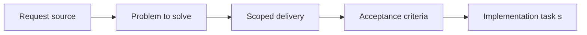

## {{DOC_REF}} - {{TITLE}}
> From version: {{FROM_VERSION}}
> Status: {{STATUS}}
> Understanding: {{UNDERSTANDING}}
> Confidence: {{CONFIDENCE}}
> Progress: {{PROGRESS}}
> Complexity: {{COMPLEXITY}}
> Theme: {{THEME}}
> Reminder: Update status/understanding/confidence/progress and linked task references when you edit this doc.

# Problem
{{PROBLEM_PLACEHOLDER}}

# Scope
- In:
- Out:

# Acceptance criteria
{{ACCEPTANCE_BLOCK}}

# AC Traceability
{{AC_TRACEABILITY_PLACEHOLDER}}

# Decision framing
- Product framing: {{PRODUCT_FRAMING_STATUS}}
- Product signals: {{PRODUCT_FRAMING_SIGNALS}}
- Architecture framing: {{ARCHITECTURE_FRAMING_STATUS}}
- Architecture signals: {{ARCHITECTURE_FRAMING_SIGNALS}}

# Links
- Product brief(s): {{PRODUCT_LINK_PLACEHOLDER}}
- Architecture decision(s): {{ARCHITECTURE_LINK_PLACEHOLDER}}
- Request: {{REQUEST_LINK_PLACEHOLDER}}
- Primary task(s): {{TASK_LINK_PLACEHOLDER}}

# Priority
- Impact:
- Urgency:

# Notes
{{NOTES_PLACEHOLDER}}
