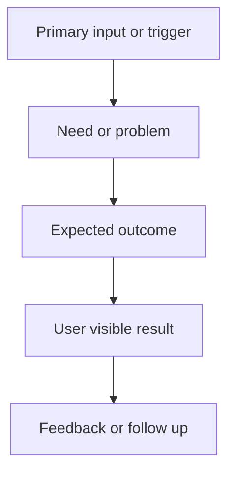

## {{DOC_REF}} - {{TITLE}}
> From version: {{FROM_VERSION}}
> Status: {{STATUS}}
> Understanding: {{UNDERSTANDING}}
> Confidence: {{CONFIDENCE}}
> Complexity: {{COMPLEXITY}}
> Theme: {{THEME}}
> Reminder: Update status/understanding/confidence and references when you edit this doc.

# Needs
- {{NEEDS_PLACEHOLDER}}

# Context
{{CONTEXT_PLACEHOLDER}}

# Acceptance criteria
- {{ACCEPTANCE_PLACEHOLDER}}

# Definition of Ready (DoR)
- [ ] Problem statement is explicit and user impact is clear.
- [ ] Scope boundaries (in/out) are explicit.
- [ ] Acceptance criteria are testable.
- [ ] Dependencies and known risks are listed.

# Companion docs
- Product brief(s): {{PRODUCT_LINK_PLACEHOLDER}}
- Architecture decision(s): {{ARCHITECTURE_LINK_PLACEHOLDER}}

# Backlog
{{BACKLOG_PLACEHOLDER}}
