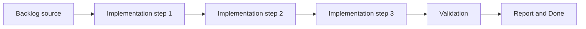

## {{DOC_REF}} - {{TITLE}}
> From version: {{FROM_VERSION}}
> Status: {{STATUS}}
> Understanding: {{UNDERSTANDING}}
> Confidence: {{CONFIDENCE}}
> Progress: {{PROGRESS}}
> Complexity: {{COMPLEXITY}}
> Theme: {{THEME}}
> Reminder: Update status/understanding/confidence/progress and dependencies/references when you edit this doc.

# Context
{{CONTEXT_PLACEHOLDER}}

# Plan
- [ ] 1. {{STEP_1}}
- [ ] 2. {{STEP_2}}
- [ ] 3. {{STEP_3}}
- [ ] FINAL: Update related Logics docs

# AC Traceability
- AC1 -> Implemented in the steps above. Proof: add test/commit/file links.

# Decision framing
- Product framing: {{PRODUCT_FRAMING_STATUS}}
- Product signals: {{PRODUCT_FRAMING_SIGNALS}}
- Architecture framing: {{ARCHITECTURE_FRAMING_STATUS}}
- Architecture signals: {{ARCHITECTURE_FRAMING_SIGNALS}}

# Links
- Product brief(s): {{PRODUCT_LINK_PLACEHOLDER}}
- Architecture decision(s): {{ARCHITECTURE_LINK_PLACEHOLDER}}
- Backlog item: {{BACKLOG_LINK_PLACEHOLDER}}
- Request(s): {{REQUEST_LINK_PLACEHOLDER}}

# Validation
- {{VALIDATION_1}}
- {{VALIDATION_2}}

# Definition of Done (DoD)
- [ ] Scope implemented and acceptance criteria covered.
- [ ] Validation commands executed and results captured.
- [ ] Linked request/backlog/task docs updated.
- [ ] Status is `Done` and progress is `100%`.

# Report
{{REPORT_PLACEHOLDER}}
