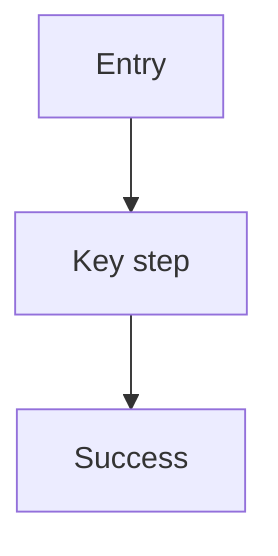

## {{DOC_REF}} - {{TITLE}}
> From version: {{FROM_VERSION}}
> Understanding: {{UNDERSTANDING}}
> Confidence: {{CONFIDENCE}}

# Overview
{{OVERVIEW}}

# Target users & scenario
- {{SCENARIO_1}}

# Current UX issues
- {{ISSUE_1}}

# Goals
- {{GOAL_1}}

# Non-goals
- {{NON_GOAL_1}}

# Proposed solution
{{SOLUTION}}

# User flows (Mermaid)

# Screens & states
- Screen: {{SCREEN_1}}
  - States: default / loading / empty / error

# Components impacted
- Reuse:
- New:

# Accessibility & responsiveness
- A11y:
- Responsive:

# Success metrics & instrumentation
- KPI:
- Events/logs:

# Rollout / experiment
- Rollout plan:

# Open questions
- {{QUESTION_1}}

